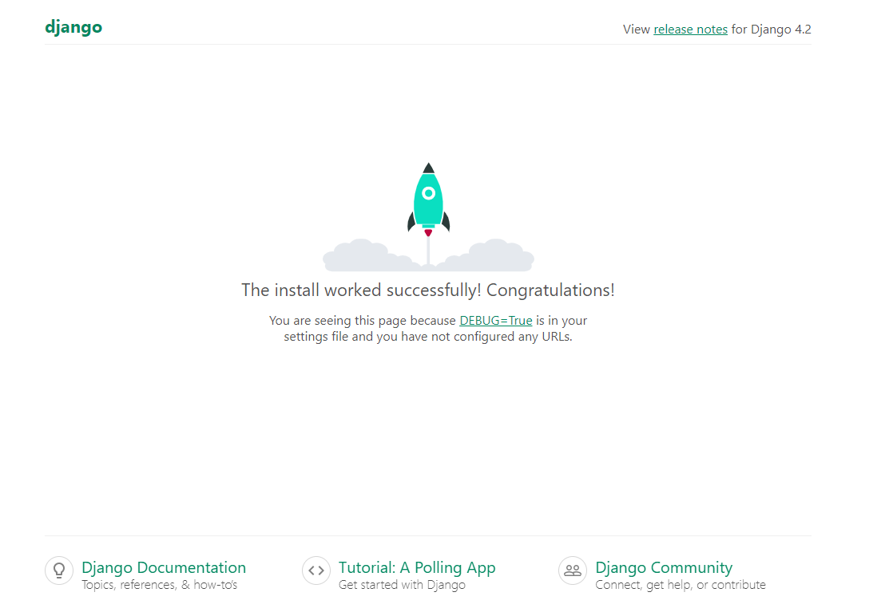

# Agizo
<!-- markdownlint-disable MD013 -->
[](https://github.com/apexDev37/Agizo/blob/main/README.md) [](https://github.com/apexDev37/Agizo/actions/workflows/ci.yaml) [](https://codecov.io/gh/apexDev37/Agizo) [](https://github.com/apexDev37/Agizo/blob/main/tox.ini#L5) [](https://www.docker.com/products/docker-desktop/) [](https://snyk.io/test/github/apexDev37/Agizo)  
[](http://makeapullrequest.com) [](https://github.com/apexDev37/Agizo/commits/main) [](https://semver.org/) [](https://github.com/pre-commit/pre-commit) [](https://github.com/astral-sh/ruff) [](https://github.com/psf/black)
<!-- markdownlint-enable MD013 -->

> A simple backend RESTful service to process orders and notify customers.

## Introduction

### Preface

This repo demonstrates a simple REST-centered backend service exposing
endpoints to clients to create `customer` and `order` resources. It integrates
with common third-party providers to serve notifications to customers and
manage user authentication. All comments, feedback, and contributions are
highly encouraged. I always eager to learn and hear from the community❤

Learn more about the Django framework from the official [documentation].

### Project Structure
>
> 🧭 Simple layout overview that highlights essential areas of the project for
quick reference.
<!-- markdownlint-disable MD013 -->
```markdown
.
├── .github                             # Hosts workflows and actions (CI/CD)
├── db                                  # Hosts db related config files.
│   ├── config
│   │   └── connection-params.yaml
│   ├── secrets
│   └── storage.yaml
├── requirements                        # Hosts all project dependencies.
├── src                                 # Hosts project source code (implicit namespace package).
│   ├── config                          # The Django project (package).
│   │   ├── settings                    # Django project environment settings (package).
│   ├── Dockerfile
│   └── manage.py
├── test_utils                          # Importable test utilities (package).
├── tests                               # Host all project tests (implicit namespace package).
├── Makefile                            # Base project automation recipes.
├── README.md  
├── compose.yaml                        # Base local compose app model.
├── pyproject.toml                      # Hosts project tooling configs.
└── tox.ini                             # Automated test orchestration and interface.
```
<!-- markdownlint-enable MD013 -->

## Installing / Getting started

This is an overview of the minimal setup needed to get started.

### Prerequisites

- [Git]
- [Docker Desktop] (latest version)
- IDE/Code/Text editor ([PyCharm], [VScode], [Vim], etc)

Follow these tutorials to set up Docker and Compose on either [Mac]
or [Linux].  
I'd recommend Microsoft's documentation to set up [Docker on WSL2] if you're on Windows.

### Local Setup

> The following setup was run on Ubuntu focal (20.04.6 LTS)

You can clone this repo with the following command.

- Clone repository

```bash
# cd your/desired/target/dir
git clone git@github.com:apexDev37/Agizo.git my-project
cd my-project
```

> 🛈 This will clone the repository to a target dir on your host machine with
 a custom name `my-project/` and navigate into its root dir.

### Configuration

> The following commands assume execution occurs at the project root.

Before running your application with Compose, configure [environment] variables
and [secrets] expected by the Compose app model. Sample `env` and `secret`
files are provided to configure the following services: `web` and `db`. You can
create the required config files with the following `make` target commands.
After the config files are created, replace the placeholders and empty `txt`
files with your custom values.

> 🛈 `secret` files should store sensitive or confidential data, whereas `env`
files can contain other environment-related config.  

- Create required config files

```bash
make envs && make secrets  # idempotent operations.
```

> 🛈 This will create and output all config files generated from available
sample files in their target directory
(ie. `django.env.example` -> `django.env`).  

- Update placeholder config values  

> 💡 `secret` files intended to store keys or passwords are auto-populated with
> a random, cryptographic, base64-encoded value.

### Launch

You're all set to run your Django application.
Spin up your Django and Postgres instances with the following command.

- Spin up containers

```bash
docker compose down
docker compose up -d
```

> 🛈 This will create and start the Django and Postgres instances in the same
network defined in the base `compose` file.

Once the containers have been created and started, you can access the
application at <http://localhost:8000/>


## Development

This is an overview to prepare working with this repo locally.

### Virtual Environment

You can use any tool of your choice to create a [PEP 405 compliant] virtual
environment. The following example uses `virtualenvwrapper` to create and
manage virtual environments.

- Create a virtual environment

```bash
mkvirtualenv -p python3.12 agizo-py312
```

> 🛈 This will create a fully managed venv and activate the virtual environment
by default.

If your environment is not activated from the above command or you encounter
any issue, manually activate it with the following command.

- Activate the virtual environment

```bash
workon agizo-py312
```

### Dependencies

> ⚠ All following commands assume execution occurs with an active virtual env
at the project root.

- Install requirements for development.

```bash
make requirements
```

> 🛈 This will install and sync the active environment with the
pinned versions for your development dependencies, `requirements/dev.txt`.

- Set up `pre-commit` hooks

```bash
pre-commit install --install-hooks
```

> 🛈 This one time setup installs the `pre-commit` script in your hidden
`git/hooks` directory and installs all hook environments defined in the config
file.

### Runtime

Run the process for the Django development server in the `web` service. You can
use the following `make` target command to run the `develop` compose override
model, which supports _hot-reload_ by watching and syncing your local files
into the container.

- Run Compose services in watch (develop) mode.

```bash
make -f compose.Makefile watch.dev
```

You can also choose to spin up a more light-weight `web` service to handle only
test-related concerns.

- Run Compose services in watch (testing) mode.

```bash
make -f compose.Makefile watch.test
```

## Testing

This is an overview to running and writing tests for this repo locally.

### Test Discovery

This project uses the test framework [pytest], which is a powerful tool for
writing and running tests. By design, this project highly encourages and only
supports running tests in container environments. This promotes test runs in an
environment that closely mirrors a production environment - the _published_
image. Spin up a `test` or `develop` compose target with the following to get
started.

- Spin up `testing` compose app model

```bash
make -f compose.Makefile watch.test
```

> 🛈 This will run all core compose services in `testing` mode to provide all
test dependencies and support both running and syncing tests written locally
into your `web` svc.

- Discover and run all project tests with `pytest`

```bash
# Run tests in web service container.
docker compose exec --user appuser -it web pytest tests/
```

> 🛈 This runs all project tests defined in `tests/` in interactive mode to
output the test results in your terminal.

### Writing Tests

This project adopts a Test-Driven Development (TDD) design approach to write
project specifications. All tests should be written and defined in the `tests/`
directory. Each test script should live in a directory that maps to a
corresponding Django app. Each test script should follow this naming convention
to prevent module resolution conflicts: `test_<app>_<module_under_test>`.

- Example

<!-- markdownlint-disable MD013 -->
```markdown
.
├── tests
│   ├── accounts  # Maps to accounts app (package).
│   │   ├── test_account_serializers.py
│   │   └── test_account_views.py
│   ├── config  # Maps to Django project (package).
│   │   └── test_utils.py
│   └── orders  # Maps to orders app (package).
│       ├── test_order_models.py
│       ├── test_order_services.py
│       └── test_order_views.py│
```
<!-- markdownlint-enable MD013 -->

> 🛈 Given that pytest recommends not making tests importable (packages), but
standalone scripts, the chosen naming convention prevents name resolution
conflicts during test discovery that may have been averted by using a
`__init__.py` file.

### Coverage

This repo supports coverage checks which should ideally be run frequently,
especially prior to pushing your changes to a remote branch. Find or
optionally modify this repo's coverage config defined in `pyproject.toml`. You
can run project-wide coverage metrics in the `web` svc with the following
command.

- Measure and report coverage metrics

```bash
# Run coverage in web service container.
docker compose exec --user root -it web \
pytest --cov --cov-config=pyproject.toml tests/
```

> 🛈 The `--user` flag is currently required to given `SQLite` read/write
permissions in the container's working dir to define the data file `.coverage`
used by `coverage` to store metrics and derive report data.

## Licensing

To make a repository open source, you must license it so that others may freely
use, modify, and distribute the software. Using the [MIT license], this project
ensures this. The full original text version of the license may be seen [here].

[//]: # "These are reference links used in the body of this note and get stripped out when the markdown processor does
its job. There is no need to format nicely because it shouldn't be seen.
Thanks SO - http://stackoverflow.com/questions/4823468/store-comments-in-markdown-syntax"

<!-- Introduction links -->
[documentation]: https://docs.djangoproject.com/en/

<!-- Installing / Getting Started links -->
[Git]: https://git-scm.com/
[Docker Desktop]: https://www.docker.com/products/docker-desktop/
[Mac]: https://docs.docker.com/desktop/install/mac-install/
[Linux]: https://docs.docker.com/desktop/install/linux-install/
[Docker on WSL2]: https://learn.microsoft.com/en-us/windows/wsl/tutorials/wsl-containers/
[PyCharm]: https://www.jetbrains.com/pycharm/
[VScode]: https://code.visualstudio.com/
[Vim]: https://www.vim.org/
[environment]: https://docs.docker.com/compose/environment-variables/set-environment-variables/
[secrets]: https://docs.docker.com/compose/use-secrets/

<!-- Developing -->
[PEP 405 compliant]: https://peps.python.org/pep-0405/#specification

<!-- Developing -->
[pytest]: https://docs.pytest.org/en/stable/contents.html

<!-- Licensing links -->
[MIT license]: https://en.wikipedia.org/wiki/MIT_License
[here]: https://choosealicense.com/licenses/mit/
